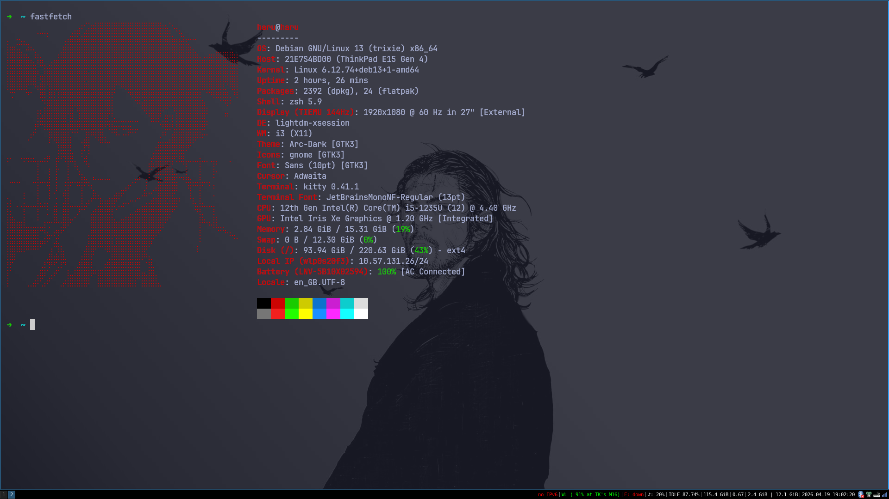
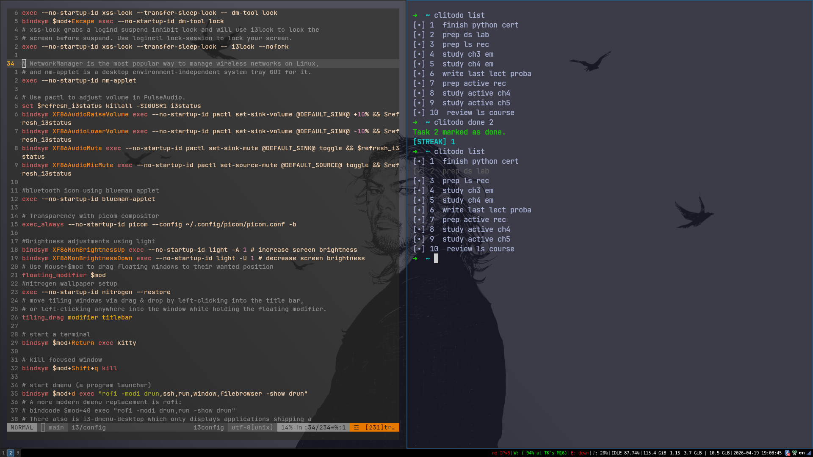

# My Debian i3wm Dotfiles
Setup for my 2nd Year EEE workstation.
 
I recently switched to debian 13 after my ubuntu system broke.  
I'm loving the experience so far :>  
for now my workflow contains is built on the following:  
- **Window Manager:**  i3-WM
- **Bar:** i3bar
- **App Launcher:** rofi
- **Screenshot:** flameshot & maim
- **Terminal:** Kitty 
- **Shell:** zsh
- **Text Editor:** VIM
- **Wallpaper setter:** nitrogen
- **Compositor:** picom (for X11)
- **Notifications deamon:** dunst
- **Clipboard manager:** xclip
- **Login screen:** lightdm-greeter
- **VHDL compiler:** ghdl
- **Waves simulator:** gtkwave
 
